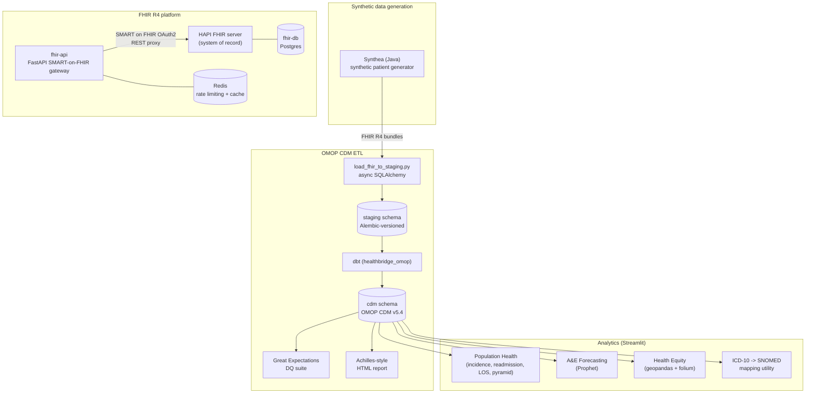

# Architecture

HealthBridge has three independently runnable services sharing two Postgres databases,
orchestrated by a single `docker-compose.yml`.

## System diagram

## Components

| Component | Tech | Role |
|---|---|---|
| `hapi-fhir` | HAPI FHIR (Java), Postgres | System of record for FHIR R4 resources |
| `fhir-api` | FastAPI, Pydantic v2, Authlib, Redis | SMART on FHIR OAuth2 gateway: auth, scope enforcement, rate limiting, search-result caching, in front of HAPI FHIR |
| `etl` | Synthea, async SQLAlchemy, Alembic, dbt, Great Expectations | Synthetic patient generation -> FHIR extraction -> staging -> OMOP CDM v5.4, with concept mapping and data-quality checks |
| `analytics` | Streamlit, pandas, Prophet, geopandas/folium | Population health dashboard, A&E demand forecasting, health-equity choropleth, ICD-10->SNOMED mapping utility |

## Data flow

1. **Synthea** generates synthetic patients as FHIR R4 bundles (Patient, Encounter,
   Condition, Observation, plus resource types this project doesn't use).
2. **`load_fhir_to_staging.py`** parses those bundles and upserts a flattened
   representation into the `staging` schema (Postgres, schema versioned by Alembic).
3. **dbt** reads `staging.*` as sources, assigns integer surrogate keys, maps
   ICD-10/SNOMED/LOINC source codes to OMOP concepts via the seeded vocabulary subset, and
   materializes the OMOP CDM v5.4 tables in the `cdm` schema.
4. **Great Expectations** validates the `cdm` tables against a set of expectation suites;
   a lightweight, from-scratch Achilles-style report summarizes the population.
5. **The Streamlit analytics app** queries `cdm.*` directly for all dashboards.
6. Independently, **HAPI FHIR** holds live FHIR resources (this project doesn't currently
   push Synthea data into HAPI FHIR automatically -- see `services/fhir-api/README.md` for
   how to POST resources through the gateway), and the **fhir-api** gateway provides
   SMART-on-FHIR-secured, rate-limited, cached access to it.

The FHIR platform and the OMOP ETL/analytics side are deliberately loosely coupled: FHIR
is the *transactional* clinical data API (SMART app launches, point-of-care access),
while OMOP CDM is the *analytical* warehouse (population health, research-style queries).
This mirrors how real health data platforms separate these concerns rather than serving
both from the same store.

## Why two Postgres databases instead of one

`fhir-db` (HAPI FHIR's store) and `omop-db` (the ETL warehouse) are separate Postgres
instances rather than separate schemas in one database, because they have different
operational profiles in a real deployment: the FHIR store is small, hot,
transactional, and often needs to be wiped/reset independently during development, while
the OMOP warehouse is analytical, larger, and rebuilt wholesale by `dbt run`. Keeping them
as separate containers also means `docker compose down -v` on one doesn't risk the other.
